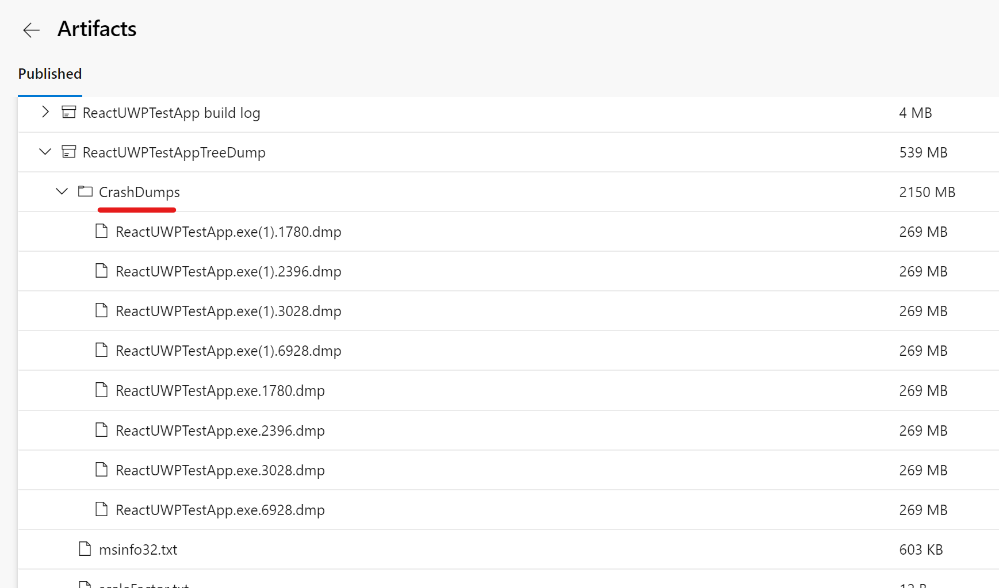
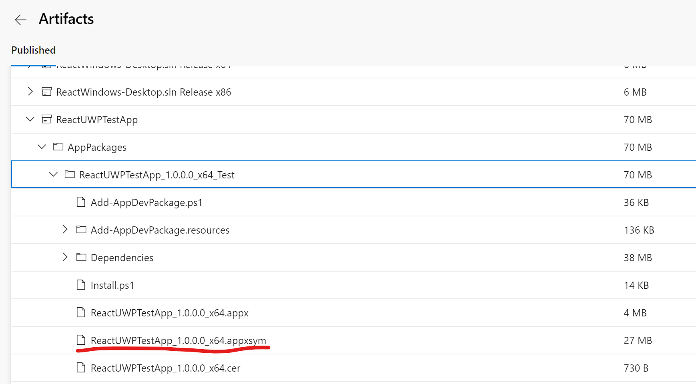

# E2E Testing

## E2E project structure

E2E test app, test library and test cases are in [`/packages/E2ETest/`](../packages/E2ETest/README.md), and they are organized as below.

 - `test` – includes Jest tests using webdriverio
 - `windows` – the UWP native app
 - `jest.config.js` – configuration for Jest and WebDriverIO

## Running Tests

**Install [WinAppDriver v1.2.1](https://github.com/microsoft/WinAppDriver/releases/download/v1.2.1/WindowsApplicationDriver_1.2.1.msi)**

This will be automatically done for you if you use the [RNW dependency script](https://microsoft.github.io/react-native-windows/docs/rnw-dependencies) with `rnwDev` as an argument.


**Build the native test app**

> C:\repo\react-native-windows> `cd packages\E2ETest`
>
> C:\repo\react-native-windows\packages\E2ETest> `yarn windows --no-launch`

**Running all tests**

> C:\repo\react-native-windows\packages\E2ETest> `yarn e2etest`

**Running a specific test**

> C:\repo\react-native-windows\packages\E2ETest> `yarn e2etest -t visitAllPages`

## Debugging E2E Tests in CI
### Increasing verbosity
By default the only messages printed during tests are related to errors returned by WinAppDriver or assertion failures. It is possible to increase verbosity to show individual WebDriver wire commands by editing [`/packages/E2ETest/jest.config.js`](../packages/E2ETest/jest.config.js).

```js
module.exports = {
...
  testEnvironmentOptions: {
    ...
    webdriverOptions: {
      // Level of logging verbosity: trace | debug | info | warn | error
      logLevel: 'error',
      ...
    },
  },
};
```

### Test Artifacts

If you have access to the AzureDevOps pipeline you'll be able to see test failures and debug crashes.
Here are the artifacts that are produced during the build:
- error screenshots of the app when a test failed
- test run XML - this contains some information like the name of the wdio test that failed and the JS stack
- tree dump outputs - you can compare these to the masters to see if there is a the difference responsible for the test failing. 
- crash dumps of the e2e test app (ReactUWPTestApp)

You can access these by going to the AzureDevOps run for your PR and clicking on the artifacts link:


Then you can access crash dumps under the `ReactUWPTestAppTreeDump\CrashDumps` folder.


You can get the symbols from the `appxsym` (just download it and rename it to `.zip`):


 The `ReactUWPTestAppTreeDump` folder will also contain any tree dump outputs that were produced that did not match the masters.

## Architecture

### WinAppDriver

WinAppDriver uses [UIA](https://docs.microsoft.com/en-us/windows/uwp/design/accessibility/accessibility-testing) to
inspect and manipulate a test application, allowing clients to connect to it using the w3c WebDriver protocol.

### WebDriverIO

WebDriverIO is a JavaScript library which connects to WinAppDriver using the WebDriver protocol. It provides global
APIs for querying the application UI tree such as selectors (see below) and a global `browser` object to manipulate the
test application.

### Jest

Jest is the test runner used by E2ETest, including assertsion libraries, test selection, etc. WebDriverIO setup is
provided by a custom environment [`jest-environment-winappdriver`](../packages/jest-environment-winappdriver/README.md).

## Authoring Tests

Tests are written using Jest and WebDriverIO (see more below) against a test app running `RNTester`. `RNTester` example
pages are used as Test UI, which is examined via Jest tests. Tests should attempt to target an existing `RNTester` page, but "Legacy" tests exist as custom pages only used by E2ETest

### Writing a test against an RNTester example page

```ts
// LegacyControlStyleTestPage.test.ts

describe('FancyWidget', () => {

  beforeAll(async () => {
    await goToComponentExample('FancyWidget');
  });

  test('FancyWidget is populated with placeholder', async () => {
    // Query for an element with accessibilityId of "foo" (see "locators" below)
    const field = await $('~foo');
    expect(await field.getText()).toBe('placeholder');
  });

});
```

### Locators to find UI Element

No matter what JavaScript framework you choose for native app testing, you have to use one of the locators which is described in [mobile JSON wire protocol](https://github.com/SeleniumHQ/mobile-spec/blob/master/spec-draft.md#locator-strategies). Since locators are implemented significant different on iOS, Android and Windows, as below I only talk about the locators for Windows.

[Locators WinAppDriver supports](https://github.com/microsoft/WinAppDriver/blob/master/Docs/AuthoringTestScripts.md#supported-locators-to-find-ui-elements)

 WinAppDriver provides rich API to help locate the UI element. If [testID](https://facebook.github.io/react-native/docs/picker-item#testid) is specified in React Native app for Windows, the locator strategy should choose `accessibility id`.

| **Client API** | **Locator Strategy** | **Matched Attribute in inspect.exe** | **Example** |
| --- | --- | --- | --- |
| FindElementByAccessibilityId | accessibility id | AutomationId | AppNameTitle |
| FindElementByClassName | class name | ClassName | TextBlock |
| FindElementById | Id | RuntimeId (decimal) | 42.333896.3.1 |
| FindElementByName | Name | Name | Calculator |
| FindElementByTagName | tag name | LocalizedControlType (upper camel case) | Text |
| FindElementByXPath | Xpath | Any | //Button[0] |

[Selectors WebDriverIO supports](https://webdriver.io/docs/selectors.html#mobile-selectors)

| **Client API by Example** | **Locator Strategy** |
| --- | --- |
| $(&#39;~AppNameTitle&#39;) | accessibility id |
| $(&#39;TextBlock&#39;) | class name |

### Adding a custom RNTester page

Before adding a custom page, consider whether the change can be made to an existing RNTester page and upstreamed. If needed, new examples may be integrated into the Windows fork of RNTester, [`@react-native-windows/tester`](../packages/@react-native-windows/tester).

Hooks are recommended to author the test page. (see [https://reactjs.org/docs/hooks-intro.html](https://reactjs.org/docs/hooks-intro.html) and this [Pluralsight course](https://app.pluralsight.com/library/courses/using-react-hooks) to learn more about Hooks)

```js
// ControlStyleTestPage.tsx
export const title = 'LegacyControlStyleTest';
export const description = 'Legacy e2e test for Control Styles';
export const examples = [
  {
    render: function(): JSX.Element {
      return <ControlStyleTestPage />;
    },
  },
];
```

```js
  // RNTesterList.windows.js
  ...
  {
    key: 'LegacyControlStyleTest',
    module: require('../examples-win/LegacyTests/ControlStyleTestPage'),
  },
  ...
```

## Tree dumps and masters

E2E tests can be summarized as follows:
- they are tests that run the ReactUWPTestApp
- use UI Automation to navigate between pages, query the state of elements, click on them, etc.
- the ReactUWPTestApp has code to produce a dump of the its own visual tree ("tree dump output") and compares it with a checked in copy ("tree dump masters") to make sure nothing has regressed. The tree dumps are produced in Json format (there is also an option to produce them in a custom text format of key=value, but that is deprecated now).

So you've added or updated some tests: great! you get a cookie*. But now you probably need to update the masters, or the tests will fail and break the CI.

\* void where prohibited, prizes and participation may vary.


The best way to do this is by letting the CI run and fail, then downloading the generated tree dump output files, and comparing to the masters. Make sure the differences are expected, copy over them and check them in. The reason is that the masters will include things like the size elements rendered at, which can be dependent on DPI, scale factor, resolution, and in some cases (due to bugs) even differ based on bitness (see #4628).

When an output doesn't match its master, a file with `.err` extension will be produced under the `TreeDump` folder in the `ReactUWPTestAppTreeDump` artifact. The content of the `.err` file will usually just say:

```txt
Tree dump file does not match master at C:\Program Files\WindowsApps\ReactUWPTestApp_1.0.0.0_x64__cezq6h4ygq1hw\Assets\TreeDump\masters\ControlStyleRoundBorder.json - See output at C:\Users\VssAdministrator\Documents\ReactUWPTestApp_cezq6h4ygq1hw\LocalState\TreeDump\ControlStyleRoundBorder.json
```


Find the corresponding `.json` file in that folder and compare it to its master. The masters live in [e2etest\windows\ReactUWPTestApp\Assets\TreeDump\masters](https://github.com/microsoft/react-native-windows/tree/master/packages/E2ETest/windows/ReactUWPTestApp/Assets/TreeDump/masters).

Sometimes you'll have an element in your test that produces output that should not be used for comparison. You can manually edit the generated json and set the output that you want to ignore to the `<ANYTHING>` value:

```json
...
"Windows.UI.Xaml.Button":
{
  "Text": "<ANYTHING>",
  ...
}
...
```


 
